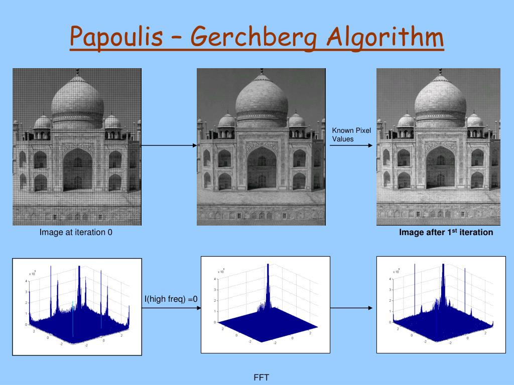

## Task

> Please briefly describe a super-resolution method proposed by Gerchberg-Papoulis by showing some examples.

As I understand it, the Gerchberg-Papoulis applies to images that have been partially blurred, or that have missing pieces in the real space. For instance this happens in medical imaging because scanners often retrieve data incompletely.

The goal of the Gerchberg-Papoulis method is to reconstruct high-resolution (with high-frequency) data from these parts of the image (which have a low resolution), using prior knowledge which states that low-resolution data is present everywhere in the image, and high-resolution data is present in some parts of the image.

I did not understand the exact procedure of the algorithm, but if I am correct, it involves shifting the phase of the image by multiplying it by a signal with a random phase, then computing the Fourier Tranform of the resulting image, then we impose the Fourier magnitude according to the prior knowledge, and go back to image space by Inverse Fourier Transform. And we repeat this process until the image converges.

 
  
 <a>Example of the results of the Gerchberg-Papoulis algorithm on 1 iteration</a>

